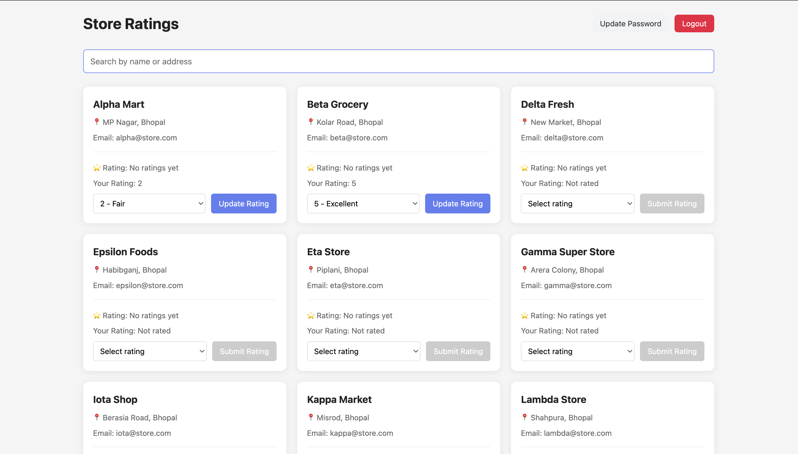

# Roxiler Store Rating System



A comprehensive full-stack web application that enables users to discover stores, submit ratings, and empowers store owners to track their performance metrics in real-time.

---

## 📋 Table of Contents

- [Overview](#overview)
- [Tech Stack](#tech-stack)
- [Live Demo](#live-demo)
- [Features](#features)
- [Installation](#installation)
- [API Documentation](#api-documentation)
- [Project Structure](#project-structure)
- [Validation Rules](#validation-rules)
- [Security](#security)

---

## 🎯 Overview

The Roxiler Store Rating System is a role-based platform designed to facilitate transparent store performance tracking through user ratings. The system supports three distinct user roles—Admin, Store Owner, and Normal User—each with tailored functionalities to ensure efficient store management and user engagement.

---

## 🛠️ Tech Stack

**Backend**
- Node.js with Express.js framework
- PostgreSQL / MySQL database
- JWT-based authentication
- RESTful API architecture

**Frontend**
- React 18+ with Vite build tool
- Modern ES6+ JavaScript
- Responsive UI design

**Deployment**
- Frontend: Vercel
- Backend: Render

---

## 🌐 Live Demo

Experience the application in action:

- **Frontend:** [https://roxiler-systems-nine.vercel.app](https://roxiler-systems-nine.vercel.app)
- **Backend API:** [https://roxiler-systems-backend-jle0.onrender.com](https://roxiler-systems-backend-jle0.onrender.com)

### Demo Credentials

Use these credentials to explore different user roles:

| Role | Email | Password |
|------|-------|----------|
| **Admin** | admin@test.com | 123456789A@ |
| **Store Owner** | owner.demo@roxiler.com | Owner@12345 |
| **Normal User** | user2@test.com | 0987654321@N |

---

## ✨ Features

### 🔑 System Administrator

The admin role provides comprehensive system management capabilities:

- **Dashboard Analytics:** View real-time statistics 
- **User Management:** Create, view, filter, search, and delete user accounts
- **Store Management:** Create, assign owners, and delete stores
- **Rating Oversight:** Access and monitor all user ratings across the platform
- **Advanced Filtering:** Search functionality for users and stores

### 👤 Normal User

Standard users enjoy the following capabilities:

- **Account Management:** Sign up, login, and update password
- **Store Discovery:** Browse all registered stores with search functionality
- **Search & Filter:** Find stores by name or address
- **Rating Submission:** Submit ratings on a 1-5 scale
- **Rating Updates:** Modify previously submitted ratings

### 🏪 Store Owner

Store owners have access to performance tracking tools:

- **Authentication:** Secure login with password management
- **Store Dashboard:** View detailed store information and metrics
- **Customer Insights:** See complete list of users who rated the store
- **Performance Metrics:** Monitor average store rating

---

## 📥 Installation

### Prerequisites

- Node.js (v14 or higher)
- PostgreSQL or MySQL database
- npm or yarn package manager

### Backend Setup

1. Navigate to the backend directory:
```bash
cd Backend
npm install
```

2. Create a `.env` file in the Backend directory:
```env
PORT=5000
DB_PORT=5432
DATABASE_URL=your_postgresql_or_mysql_connection_url
JWT_SECRET=your_secure_jwt_secret_key_change_in_production
NODE_ENV=development
```

3. Start the development server:
```bash
npm run dev
```

The backend API will be available at `http://localhost:5000`

### Frontend Setup

1. Navigate to the frontend directory:
```bash
cd frontend
npm install
```

2. Create a `.env` file in the frontend directory (if needed):
```env
VITE_API_URL=http://localhost:5000
```

3. Start the development server:
```bash
npm run dev
```

The frontend will be available at `http://localhost:5173`

---

## 📡 API Documentation

### Authentication Endpoints

| Method | Endpoint | Description | Auth Required |
|--------|----------|-------------|---------------|
| POST | `/api/auth/signup` | Register new user | No |
| POST | `/api/auth/login` | User login | No |
| POST | `/api/auth/update-password` | Update user password | Yes |

### Store Endpoints

| Method | Endpoint | Description | Auth Required |
|--------|----------|-------------|---------------|
| GET | `/api/stores/admin/all` | Get all stores (admin) | Yes (Admin) |
| GET | `/api/stores/user/list` | Get all stores (user view) | Yes |
| GET | `/api/stores/:id` | Get store by ID | Yes |
| POST | `/api/stores` | Create new store | Yes (Admin) |
| DELETE | `/api/stores/:id` | Delete store | Yes (Admin) |

### Rating Endpoints

| Method | Endpoint | Description | Auth Required |
|--------|----------|-------------|---------------|
| POST | `/api/ratings/submit` | Submit/update rating | Yes |
| GET | `/api/ratings/user/:storeId` | Get user's rating for store | Yes |
| GET | `/api/ratings/store/:storeId` | Get all ratings for store | Yes (Owner) |
| GET | `/api/ratings/admin/all` | Get all ratings (admin) | Yes (Admin) |

### User Endpoints

| Method | Endpoint | Description | Auth Required |
|--------|----------|-------------|---------------|
| POST | `/api/users` | Create new user | Yes (Admin) |
| GET | `/api/users/all` | Get all users | Yes (Admin) |
| GET | `/api/users/:id` | Get user by ID | Yes (Admin) |
| GET | `/api/users/dashboard` | Get dashboard stats | Yes (Admin) |
| DELETE | `/api/users/:id` | Delete user | Yes (Admin) |

---

## 📁 Project Structure
```
RBackend/
  src/
    controllers/
    routes/
    middleware/
    validators/

frontend/
  src/
    components/
    pages/
    services/
    styles/

└── README.md
```

---

## ✅ Validation Rules

The application enforces strict validation rules to ensure data integrity:

### Store Information
- **Name:** 20-60 characters
- **Address:** Maximum 400 characters

### User Authentication
- **Password Requirements:**
  - Length: 8-16 characters
  - Must contain at least 1 uppercase letter
  - Must contain at least 1 special character
  - Example valid password: `MyP@ssw0rd`

- **Email:** Standard email format (RFC 5322 compliant)

### Ratings
- **Value:** Integer between 1-5 (inclusive)
- **Uniqueness:** One rating per user per store

---

## 🔒 Security

The application implements multiple security measures:

- **JWT Authentication:** Secure token-based authentication for protected routes
- **Password Hashing:** User passwords are encrypted using industry-standard hashing
- **Role-Based Access Control (RBAC):** Endpoint authorization based on user roles
- **Input Validation:** Server-side validation prevents malicious data injection
- **CORS Configuration:** Controlled cross-origin resource sharing

---

## 🚀 Deployment

### Backend Deployment (Render)

1. Connect your GitHub repository to Render
2. Set environment variables in Render dashboard
3. Configure build command: `npm install`
4. Configure start command: `npm start`

### Frontend Deployment (Vercel)

1. Connect your GitHub repository to Vercel
2. Set root directory to `frontend`
3. Configure build command: `npm run build`
4. Configure output directory: `dist`

---

## 📝 License

This project is available for assessment and educational purposes.

---

## 👥 Contributors

Developed as part of Roxiler Systems assessment.

---

## 📞 Support

For questions or issues, please create an issue in the repository or contact the development team.

---

